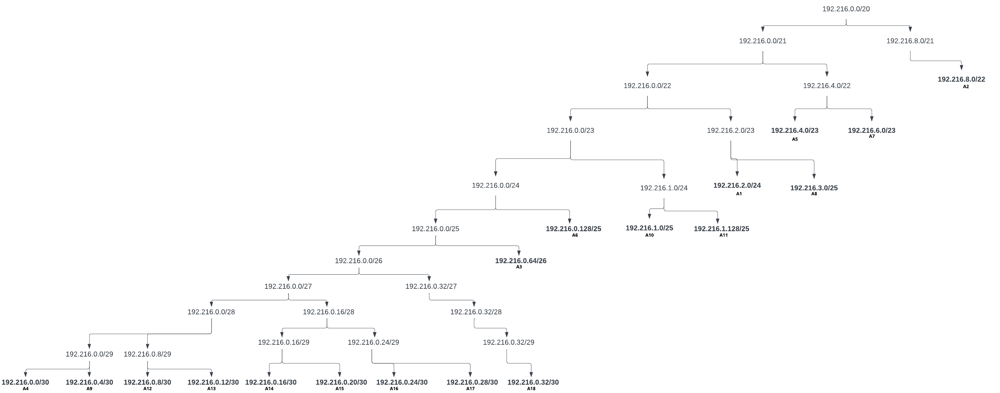
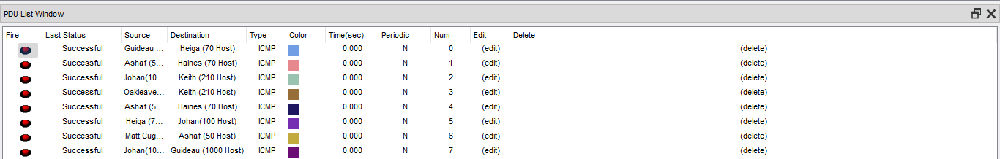

# Jarkom-Modul-3-ITB04-2022

Pengerjaan Soal Shift Komunikasi Data dan Jaringan Komputer Modul 4 oleh ITB04

# Anggota

| Nama                           | NRP          | 
| -------------------------------| -------------| 
| Nadine Haninta                 | `5027201014` | 
| Maulanal Fatihil A. M          | `5027201031` | 
| Dzaki Indra Cahya              | `5027201053` |

# Konten
* [Sumber Soal dan Resource Praktikum Komunikasi Data dan Jaringan Komputer Modul 4 Tahun 2022](#sumber-soal-dan-resource-praktikum-komunikasi-data-dan-jaringan-komputer-modul-4-tahun-2022)
    * [Sumber Soal](#sumber-soal)
* [Metode VLSM di Cisco Packet Tracer](#metode-vlsm-di-cisco-packet-tracer)
    * [Langkah dan Hasil Mapping IP Address](#langkah-dan-hasil-mapping-ip-address)
    * [Routing Topologi](#routing-topologi)
    * [Uji Ping VLSM di Cisco Packet Tracer](#uji-ping-vlsm-di-cisco-packet-tracer)
    * [Kendala yang Dihadapi](#kendala-vlsm)
* [Metode CIDR di GNS3](#soal-1)
    * [Langkah dan Hasil Mapping IP Address](#jawaban-soal-2)
    * [Routing Topologi](#penyelesaian-dan-dokumentasi-soal-2)
    * [Uji Ping](#kendala-soal-1)
    * [Kendala yang Dihadapi]()
___
## Sumber Soal dan Resource Praktikum Komunikasi Data dan Jaringan Komputer Modul 4 Tahun 2022
Adapun untuk soal dan _resource_ yang digunakan dalam praktikum 4
### Sumber Soal
Sebagai berikut adalah soal yang digunakan dalam praktikum,
[sumber soal.](https://docs.google.com/document/d/1a_ITp6WYIqoJFXA2oL1jkox9AzqYGxicjr2LGPBsqBE/edit?usp=sharing) <br>
Adapun topologi yang digunakan adalah sebagai berikut, <br>


## Metode VLSM di Cisco Packet Tracer

### Langkah dan Hasil Mapping IP Address
1) Dari topologi yang sudah diberikan, dipetakan kebutuhan host tiap node dan diberi nama untuk tiap node yang membutuhkan host. Adapun hasil pemetaan adalah sebagai berikut, 

| Nama                           | Jenis Jaringan | Nama Subnet | Host yang Dibutuhkan |
| ------------------------------ | -------------- | ----------- | -------------------- |
| Keith                          | Subnet         | A1          | 212                  |
| Guideau                        | Subnet         | A2          | 1001                 |
| Ashaf                          | Subnet         | A3          | 51                   |
| The Beast                      | Switch-server  | A4          | 2                    |
| Haines + Corvekt               | Subnet         | A5          | 271                  |
| Spendrow                       | Subnet         | A6          | 121                  |
| Oakleave                       | Subnet         | A7          | 501                  |
| Phanora + Johan                | Subnet         | A8          | 251                  |
| The Witch                      | Switch-server  | A9          | 2                    |
| Helga                          | Subnet         | A10         | 71                   |
| Matt Cugat                     | Subnet         | A11         | 121                  |
| The Resonance + The Magical    | Router-router  | A12         | 2                    |
| The Resonance + The Order      | Router-router  | A13         | 2                    |
| The Resonance + The Instrument | Router-router  | A14         | 2                    |
| The Order + The Minister       | Router-router  | A15         | 2                    |
| The Instrument + The Firefist  | Router-router  | A16         | 2                    |
| The Instrument + The Profound  | Router-router  | A17         | 2                    |
| The Minister + The Dauntless   | Router-router  | A18         | 2                    |
2) Di sini, dijumlahkan host yang dibutuhkan. Dalam kasus ini, didapatkan bahwa ada total **2618 host**. Sehingga, digunakan mask `/20` yang berkapasitas 4096 alamat dengan total 4094  alamat IP yang dapat digunakan.

2) Setelah memetakan kebutuhan dan nama dari node yang membutuhkan host, dipetakan mask sesuai dengan kebutuhan host-nya,

| Nama Subnet | IP yang Dialokasikan | IP yang Dapat Digunakan | Mask | Subnet Mask     |
| ----------- | -------------------- | ----------------------- | ---- | --------------- |
| A1          | 256                  | 254                     | /24  | 255.255.255.0   |
| A2          | 1024                 | 1022                    | /22  | 255.255.252.0   |
| A3          | 64                   | 62                      | /26  | 255.255.255.192 |
| A4          | 4                    | 2                       | /30  | 255.255.255.252 |
| A5          | 512                  | 510                     | /23  | 255.255.254.0   |
| A6          | 128                  | 126                     | /25  | 255.255.255.128 |
| A7          | 512                  | 510                     | /23  | 255.255.254.0   |
| A8          | 256                  | 254                     | /24  | 255.255.255.0   |
| A9          | 4                    | 2                       | /30  | 255.255.255.252 |
| A10         | 128                  | 126                     | /25  | 255.255.255.128 |
| A11         | 128                  | 126                     | /25  | 255.255.255.128 |
| A12         | 4                    | 2                       | /30  | 255.255.255.252 |
| A13         | 4                    | 2                       | /30  | 255.255.255.252 |
| A14         | 4                    | 2                       | /30  | 255.255.255.252 |
| A15         | 4                    | 2                       | /30  | 255.255.255.252 |
| A16         | 4                    | 2                       | /30  | 255.255.255.252 |
| A17         | 4                    | 2                       | /30  | 255.255.255.252 |
| A18         | 4                    | 2                       | /30  | 255.255.255.252 |

3) Setelah dipetakan, node-node tersebut diurutkan dari yang kebutuhan hostnya paling sedikit. Sehingga, secara singkat hasil pemetaan menjadi seperti ini.

| Nama Subnet | IP yang Dialokasikan | IP yang Dapat Digunakan | Mask | Subnet Mask     |
| ----------- | -------------------- | ----------------------- | ---- | --------------- |
| A4          | 4                    | 2                       | /30  | 255.255.255.252 |
| A9          | 4                    | 2                       | /30  | 255.255.255.252 |
| A12         | 4                    | 2                       | /30  | 255.255.255.252 |
| A13         | 4                    | 2                       | /30  | 255.255.255.252 |
| A14         | 4                    | 2                       | /30  | 255.255.255.252 |
| A15         | 4                    | 2                       | /30  | 255.255.255.252 |
| A16         | 4                    | 2                       | /30  | 255.255.255.252 |
| A17         | 4                    | 2                       | /30  | 255.255.255.252 |
| A18         | 4                    | 2                       | /30  | 255.255.255.252 |
| A3          | 64                   | 62                      | /26  | 255.255.255.192 |
| A6          | 128                  | 126                     | /25  | 255.255.255.128 |
| A10         | 128                  | 126                     | /25  | 255.255.255.128 |
| A11         | 128                  | 126                     | /25  | 255.255.255.128 |
| A1          | 256                  | 254                     | /24  | 255.255.255.0   |
| A8          | 256                  | 254                     | /24  | 255.255.255.0   |
| A5          | 512                  | 510                     | /23  | 255.255.254.0   |
| A7          | 512                  | 510                     | /23  | 255.255.254.0   |
| A2          | 1024                 | 1022                    | /22  | 255.255.252.0   |

4) Melihat mask dari total host yang digunakan, `/20`, dilakukan pemecahan. Sehingga dalam VLSM, tree yang terbentuk adalah sebagai berikut,



5) Didasarkan tree tersebut, juga dipetakan alamat IP-nya. Sehingga didapatkan

| Nama Subnet | Nama                           | Jenis Jaringan | Host yang Dibutuhkan | IP yang Dialokasikan | IP yang Dapat Digunakan | Mask | Subnet Mask     | Network ID    | Broadcast ID   |
| ----------- | ------------------------------ | -------------- | -------------------- | -------------------- | ----------------------- | ---- | --------------- | ------------- | -------------- |
| A4          | The Beast                      | Switch-server  | 2                    | 4                    | 2                       | /30  | 255.255.255.252 | 192.216.0.0   | 192.216.0.3    |
| A9          | The Witch                      | Switch-server  | 2                    | 4                    | 2                       | /30  | 255.255.255.252 | 192.216.0.4   | 192.216.0.7    |
| A12         | The Resonance + The Magical    | Router-router  | 2                    | 4                    | 2                       | /30  | 255.255.255.252 | 192.216.0.8   | 192.216.0.11   |
| A13         | The Resonance + The Order      | Router-router  | 2                    | 4                    | 2                       | /30  | 255.255.255.252 | 192.216.0.12  | 192.216.0.15   |
| A14         | The Resonance + The Instrument | Router-router  | 2                    | 4                    | 2                       | /30  | 255.255.255.252 | 192.216.0.16  | 192.216.0.17   |
| A15         | The Order + The Minister       | Router-router  | 2                    | 4                    | 2                       | /30  | 255.255.255.252 | 192.216.0.20  | 192.216.0.23   |
| A16         | The Instrument + The Firefist  | Router-router  | 2                    | 4                    | 2                       | /30  | 255.255.255.252 | 192.216.0.24  | 192.216.0.27   |
| A17         | The Instrument + The Profound  | Router-router  | 2                    | 4                    | 2                       | /30  | 255.255.255.252 | 192.216.0.28  | 192.216.0.31   |
| A18         | The Minister + The Dauntless   | Router-router  | 2                    | 4                    | 2                       | /30  | 255.255.255.252 | 192.216.0.32  | 192.216.0.35   |
| A3          | Ashaf                          | Subnet         | 51                   | 64                   | 62                      | /26  | 255.255.255.192 | 192.216.0.64  | 192.216.0.127  |
| A6          | Spendrow                       | Subnet         | 121                  | 128                  | 126                     | /25  | 255.255.255.128 | 192.216.0.128 | 192.216.0.255  |
| A10         | Helga                          | Subnet         | 71                   | 128                  | 126                     | /25  | 255.255.255.128 | 192.216.1.0   | 192.216.1.127  |
| A11         | Matt Cugat                     | Subnet         | 121                  | 128                  | 126                     | /25  | 255.255.255.128 | 192.216.1.128 | 192.216.1.255  |
| A1          | Keith                          | Subnet         | 212                  | 256                  | 254                     | /24  | 255.255.255.0   | 192.216.2.0   | 192.216.2.255  |
| A8          | Phanora + Johan                | Subnet         | 251                  | 256                  | 254                     | /24  | 255.255.255.0   | 192.216.3.0   | 192.216.3.255  |
| A5          | Haines + Corvekt               | Subnet         | 271                  | 512                  | 510                     | /23  | 255.255.254.0   | 192.216.4.0   | 192.216.5.255  |
| A7          | Oakleave                       | Subnet         | 501                  | 512                  | 510                     | /23  | 255.255.254.0   | 192.216.6.0   | 192.216.7.255  |
| A2          | Guideau                        | Subnet         | 1001                 | 1024                 | 1022                    | /22  | 255.255.252.0   | 192.216.8.0   | 192.216.11.255 |

### Routing Topologi
1) The Resonance 
Karena The Resonance terhubung dengan tiga router, maka routing dihubungkan melalui tiga saluran. Masing-masing saluran terhubung dengan 
```
0.0.0.0/0 via 192.216.0.10 #Dengan The Magical
0.0.0.0/0 via 192.216.0.18 #Dengan The Instrument
0.0.0.0/0 via 192.216.0.14 #Dengan The Order
```

2) The Magical
```
0.0.0.0/0 via 192.216.0.9 #Dengan The Resonance
```

3) The Order
```
0.0.0.0/0 via 192.216.0.13 #Dengan The Resonance
0.0.0.0/0 via 192.216.0.22 #Dengan The Minister

```

4) The Dauntiess
```
0.0.0.0/0 via 192.216.0.33 #Dengan The Minister
```

5) The Instrument
```
0.0.0.0/0 via 192.216.0.17 #Dengan The Resonance
0.0.0.0/0 via 192.216.0.26 #Dengan The Firefist
0.0.0.0/0 via 192.216.0.30 #Dengan The Profound
```

6) The Profound
```
0.0.0.0/0 via 192.216.0.29 #Dengan The Instrument
```

7) The Firefist
```
0.0.0.0/0 via 192.216.0.25 #Dengan The Instrument
0.0.0.0/0 via 192.216.2.211 #Dengan The Queen
```

8) The Queen
```
0.0.0.0/0 via 192.216.2.1 #Dengan The Firefist
```
<br>

### Uji Ping VLSM di Cisco Packet Tracer
<br><br>

### Kendala VLSM
Untuk ping, diperlukan uji coba setidaknya dua kali sebelum ping berhasil.<br><br>

## Metode CIDR di GNS3

### Langkah dan Hasil Mapping IP Address
1) Dilakukan grouping pada topologi. Secara lebih lanjut, tahapannya adalah sebagai berikut <br>
> [Grouping CIDR](https://lucid.app/lucidchart/a3602ccb-a099-48cb-aed5-7feadda2ff9c/edit?viewport_loc=-3198%2C599%2C6893%2C3099%2CQCI.SYwBYpCQ&invitationId=inv_7bbd5cc0-ee94-4697-9d7b-a99980ea451d)

2) Karena keterbatasan waktu, kami belum sempat memetakan alamat IP
